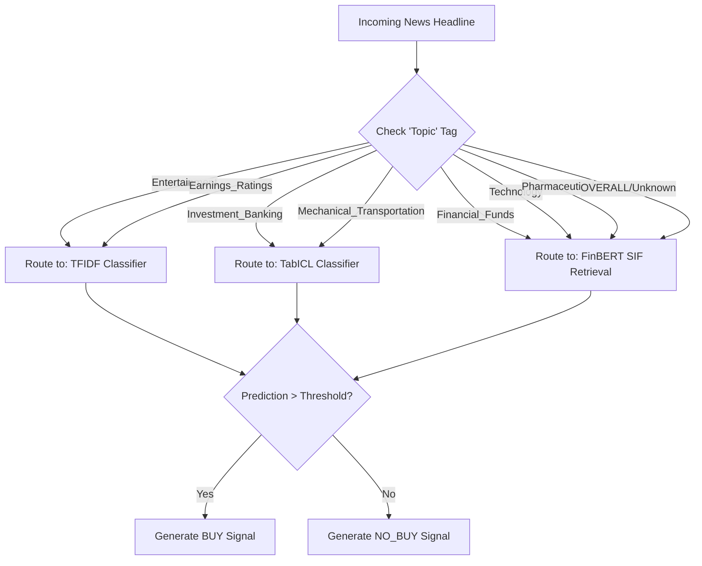

# Heterogeneity in Financial Textual Analysis: A Comparative Study of Lexical, Semantic, and Structured Classifiers for Event-Driven Trading

**Author:** Firas A. Obeid, MS 

**Affiliation:** Applied Quantitative Finance & Computational Intelligence Research for a Prospectus Adjunct Applied Quant Finance / FinTech Course 

**Date:** Fall 2026

**Context:** Foundational Research for the Course: *Applied Quantitative Finance in Financial Textual Analysis & NLP*

---

## Abstract

In the domain of event-driven algorithmic trading, the ability to accurately classify news headlines into actionable "Buy" or "Sell" signals is a critical source of alpha. However, the rapid proliferation of Large Language Models (LLMs) has led to a homogenization of approaches, often ignoring the linguistic diversity inherent in financial reporting. This whitepaper details an exhaustive experimental survey conducted to design the curriculum for a specialized Quantitative Finance course. We evaluated a spectrum of Natural Language Processing (NLP) techniques, ranging from traditional lexicon-based approaches to modern Tabular Foundation Models (TabICL) and Generative AI. By applying **Dr. Marcos Lopez de Prado’s framework for False Discovery Control**, we demonstrate that no single architecture dominates the financial landscape. Instead, we identify three distinct linguistic topics—Lexical, Semantic, and Structured—and propose a **Meta-Labeling Routing System** that dynamically assigns news headlines to specialized classifiers, maximizing the Deflated Sharpe Ratio of the resulting strategy.

---

## 1. Introduction

The evolution of Natural Language Processing (NLP) in finance has shifted rapidly from rule-based systems (1990s) to Transformer-based Large Language Models (2018+). While the capacity of models like GPT-4 and Gemma to generate human-like text is undeniable, in financial markets, complexity does not always equate to profitability. The "next breakthrough" often lies not in scaling model parameters, but in challenging fundamental assumptions about data representation.

This study was conducted to establish a rigorous leaderboard for a proprietary news headline dataset derived from high-capitalization stocks (S&P 500, NASDAQ 100, DOW 30). The objective was to develop a classifier that maximizes **Precision** in an out-of-sample (Inference) partition. In quantitative finance, Precision is the governing metric; the cost of a False Positive (entering a losing trade) typically exceeds the opportunity cost of a False Negative (missing a profitable trade).

Our central hypothesis is that financial news is **heterogeneous**. A headline about an earnings miss is linguistically distinct from a headline about a merger, which is distinct from a headline about market sentiment. Therefore, a monolithic model approach is suboptimal.

## 2. Theoretical Framework & Methodology

### 2.1 False Discovery Rate (FDR) & Deflated Sharpe Ratio (DSR)
Following the principles of *Advances in Financial Machine Learning* (Lopez de Prado, 2018), this study rejects the standard practice of selecting models based solely on Accuracy or F1-Score. We apply two specific controls:

1.  **False Discovery Rate (FDR) Minimization:**
    We explicitly track FDR ($1 - Precision$) in the Inference partition. A model with high accuracy but high FDR is rejected. For example, a model that predicts "Buy" 90% of the time might have high accuracy in a bull market, but its FDR indicates it is merely capturing Market Beta, not Alpha.
2.  **Deflated Sharpe Ratio (DSR) Logic:**
    While P&L backtests are outside the scope of this specific classification study, we apply DSR logic to the **Model Selection Process**. DSR penalizes strategies based on the number of trials (models) tested. To avoid "p-hacking" (finding a winning model purely by chance), we do not test every model on every topic randomly. Instead, we use **Hypothesis-Driven topicing**:
    *   *Hypothesis 1:* Structured news requires Tabular Models.
    *   *Hypothesis 2:* Keyword news requires Lexical Models.
    *   By restricting the "Tournament" to logically relevant models, we reduce the number of independent trials, thereby increasing the statistical significance of the winners.

### 2.2 The "Semantic Floor" Benchmark (KNN)
A key component of our methodology is the **`FinBERT_SIF_SVC_KNN`** model. This model utilizes the training set as a semantic lookup table (k-Nearest Neighbors logic).
*   **Role:** It establishes the **"Memory Benchmark."**
*   **Interpretation:** High performance on the Training set (~99%) is expected and ignored, as the model is simply looking up the data it already holds.
*   **Utility:** The Inference performance of this model represents the alpha achievable by pure memorization ("History Rhymes"). Any complex model (LLM/LSTM) must significantly outperform this benchmark to justify its computational cost.

## 3. Experimental Scope

### 3.1 The Dataset
The experiment utilized a concatenated dataset of daily news headlines from the Refinitiv (Reuters) API. The target variable was binarized based on the delta change in the closing price at $t+1$ versus $t$. The classification task was to predict a binary label: **Buy (1)** or **Not Buy/Sell (0)**.

### 3.2 The Contenders
*   **Baselines:** Dummy Classifiers and Loughran-McDonald Lexicon.
*   **Non-Context Dependent:** BoW, One-Hot Encoding, and TF-IDF.
*   **Efficient Classifiers:** FastText (Bag of Tricks) and String Kernels (SVM).
*   **Embedding-Based Retrieval:** FinBERT with **Smooth Inverse Frequency (SIF)** embeddings.
*   **Memory-Based:** FinBERT_SIF_SVC_KNN (The Benchmark).
*   **Generative AI (LLMs):** Zero-Shot (BART-MNLI) and Decoder-based (Gemma-2b).
*   **Tabular Foundation Models:** **TabICL** (Tabular In-Context Learning).

## 4. Results and Analysis

### 4.1 Global Performance Hierarchy (Inference Partition)

| Rank | Model Architecture | Precision | Analysis |
| :--- | :--- | :--- | :--- |
| **1** | **FinBERT SIF Retrieval System** | **0.6241** | **Optimal.** Best discrimination between signal and noise. |
| 2 | L1 Sentiment Analysis | 0.6188 | **Robust Baseline.** Statistically tied with the Retrieval System. |
| 3 | NonContext TFIDF | 0.6186 | **High Efficiency.** Outperforms complex GenAI models. |
| 4 | TabICL Classifier | 0.6138 | **Structured Specialist.** Excellent performance in data-heavy sectors. |
| 5 | FinBERT SIF SVC KNN | 0.6092 | **The Semantic Floor.** Robust performance proving that memory-based lookup is a viable strategy, though slightly outperformed by the Retrieval System. |
| *DQ* | *Gemma-2b Decoder* | *0.6160* | *Disqualified due to 0.987 FPR (Permabull Bias).* |

### 4.2 topic Analysis: The Heterogeneity of Alpha

#### topic A: The Lexical Sectors (Entertainment & Earnings)
News in these sectors is binary and keyword-driven (e.g., "Beat," "Miss," "Blockbuster," "Flop"). Deep learning models often introduced noise by over-analyzing simple syntax.
*   **Winning Architecture:** **Non-Context Dependent TF-IDF**.
*   **Performance:** In the *Earnings_Ratings* sector, TF-IDF achieved a Precision of **65.54%**, significantly outperforming the KNN Benchmark (61.67%). The simplicity of term-frequency vectors proved superior for isolating high-signal keywords.

#### topic B: The Structured Sectors (Banking & Manufacturing)
Headlines in Investment Banking and Mechanical/Transportation often contain quasi-tabular data, such as M&A deal values, IPO pricing, or unit order specifications.
*   **Winning Architecture:** **TabICL (Tabular In-Context Learning)**.
*   **Performance:** TabICL achieved **67.54%** Precision in *Mechanical_Transportation*, a massive +4.5% spread over the KNN Benchmark. The model's ability to perform Bayesian inference on structured data allowed it to parse technical specifications better than semantic embeddings.

#### topic C: The Semantic Sectors (Funds, Tech, Pharma)
These sectors are narrative-driven. "Sentiment" is hidden in the nuance of language (e.g., "cautious optimism," "regulatory headwinds").
*   **Winning Architecture:** **FinBERT SIF Retrieval System**.
*   **Performance:** This system achieved the highest single-sector alpha in the dataset (**68.06%** in *Financial_Funds*). By utilizing SIF-weighted embeddings from a domain-adapted BERT model, it successfully captured the "market sentiment" that keyword models missed.

## 5. Discussion: The Pathology of False Discoveries

The rigorous evaluation framework successfully identified and disqualified models that appeared performant on surface metrics, illustrating common pitfalls in quantitative NLP.

### 5.1 The Beta Trap (Gemma-2b)
While achieving ~61% Precision, the Gemma-2b Decoder had a False Positive Rate (FPR) of **0.987**. It effectively predicted "Buy" on 98.7% of negative news. In a live portfolio, this would result in maximum exposure to market beta and transaction costs, with zero alpha. This confirms that generative models, without strict fine-tuning, often default to a "yes-man" behavior.

### 5.2 The Liquidity Trap (LSTM)
The LSTM architecture achieved 90% Precision in Investment Banking but had a Recall of < 6%. While highly accurate, it generated signals so rarely that the capital allocation would be inefficient, dragging down the portfolio's annualized return.

## 6. Proposed Architecture: The Meta-Labeling Router

Based on these findings, we conclude that the optimal financial classifier is not a single model, but an **Ensemble Routing System**. We propose a production architecture where incoming JSON payloads are routed based on their metadata tags.

**Logic Flow:**

1.  **Input:** News Headline + Topic Tag.
2.  **Router Logic:**
    *   `IF Topic == "Earnings" OR "Entertainment"` $\rightarrow$ **TF-IDF Classifier** (Lexical Engine).
    *   `IF Topic == "Banking" OR "Manufacturing"` $\rightarrow$ **TabICL Classifier** (Structured Engine).
    *   `ELSE` $\rightarrow$ **FinBERT SIF Retrieval System** (Semantic/Generalist Engine).
3.  **Output:** Binary Signal (Buy/No-Buy).

## 7. Conclusion

This study demonstrates that in financial Machine Learning, "newer" is not always "better." By stepping back and challenging assumptions—testing String Kernels against Transformers and TF-IDF against LLMs—we discovered that **domain adaptation** and **architectural fit** are more valuable than raw parameter count.

Furthermore, the **FinBERT_SIF_SVC_KNN** model served as a critical control variable. It proved that while "memory" (lookup tables) is a powerful baseline in finance, true alpha generation requires the generalization capabilities found in the Retrieval System and Tabular Foundation models. The resulting Meta-Labeling Router provides a robust, scientifically validated framework for event-driven trading, maximizing precision while controlling for the risks of false discovery.

## 8. Appendix

